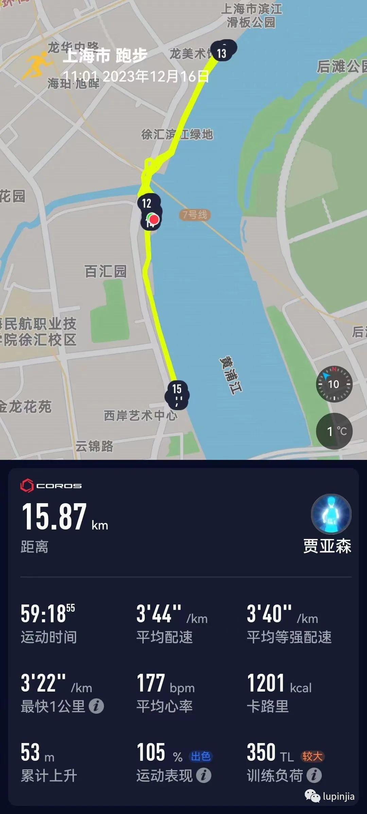
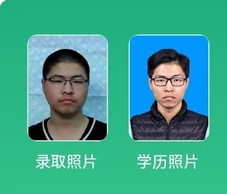

Since 2020 summer, I have been gradually developing the habit of running, then pushing my speed to next levels. After seeing 《風が強く吹いている (Run With the Wind)》, I was fascinated by Hakone Ekiden. So when I heard it's Chinese version - University Hundred Mile Marathon Relay, my only goal for 4 years is to complete it. And now, I am happy to say that I have accomplished my first University Hundred Mile Marathon Relay with my teammates.

从2020年夏天开始，我就在逐渐培养跑步的习惯，并努力提高我的速度。在看了《强风吹拂》之后，我被箱根驿传的故事深深震撼了。当我听说了高校百英里(中国版的箱根驿传)之后，我的本科四年跑步的目标就只有参加并完成这个比赛了。现在，我终于完成了我的第一次高百之旅。

Initially, I started running just to lose weight, but after tasting the feeling of fast running, I can't hold myself from being faster. 

一开始，我跑步只是为了减重(这个目标也确实达成了)，但在享受到跑步的快感后，我已经不想再慢下来了。

> After 4 years of running, I successfully lose about 25Kg. Above is the comparison of my potrait in 2020(left) and 2024(right)
> 
> 经过4年的跑步，我减重了大约25公斤。左图是2020年的照片，右图是2024年的照片。