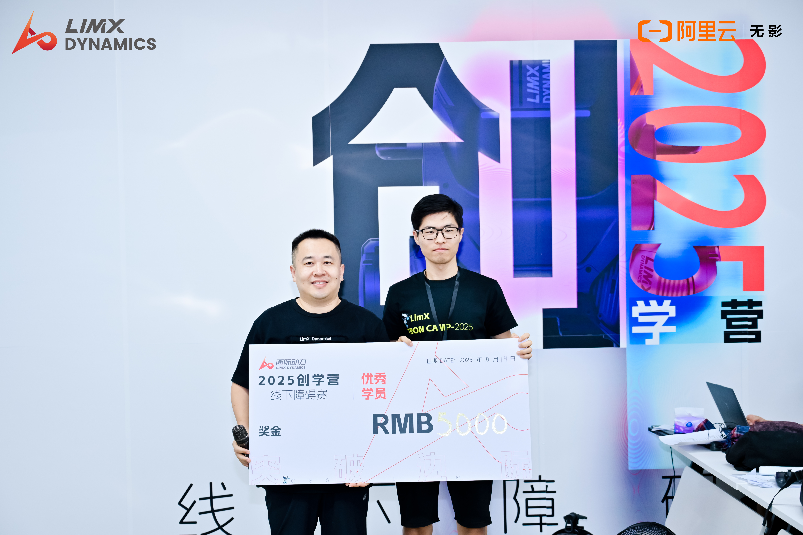

Tron Camp 2025 requires participators to accomplish the locomotion control of a pointfoot biped robot-tron1. It's seperated into two phases: online simulation competition and offline obstacle-crossing competition. People who performed well in online competition could have the opportunity to attend offline competition. 

I designed a controller for the biped robot to cross stairs, grassland, pebble road and discrete obstacles stably and pass through the height restriction bar successfully. The controller is composed of two policy-estimator sets, one for uneven terrain and the other for base height variation on the flat ground. 

Here is the demo video for the biped robot crossing terrains: [video](https://www.bilibili.com/video/BV1MdePzcEvk/)

